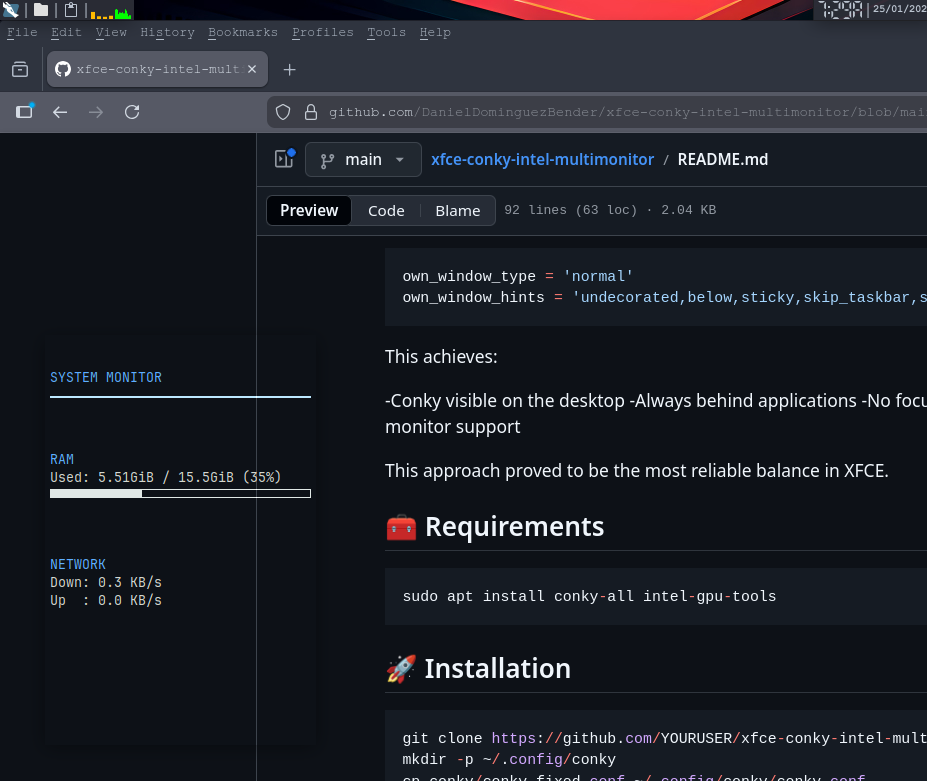
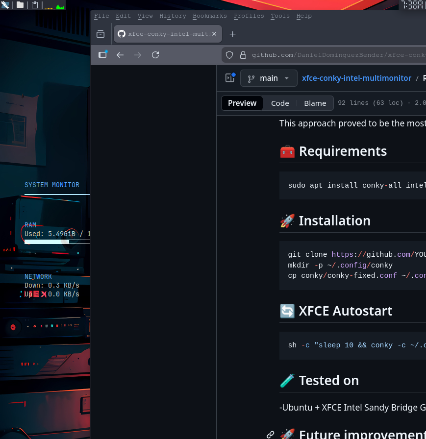
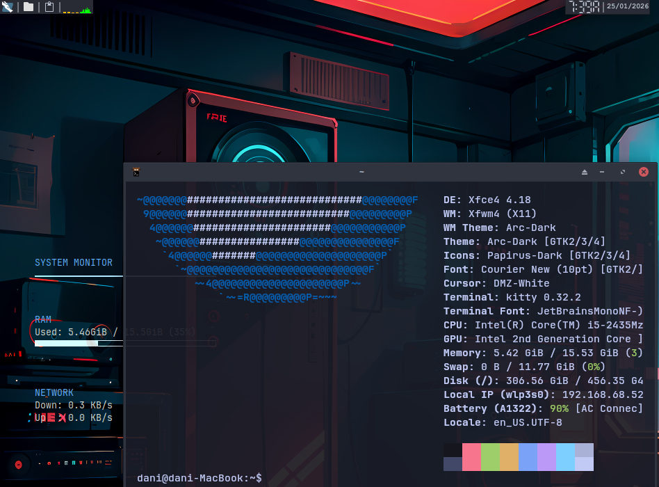

# XFCE + Conky (Intel GPU)

Minimal and lightweight **Conky setup for XFCE**, designed for older Intel-based laptops.

This project documents not only the final solution, but also a **real-world window stacking issue** and how it was solved.

---

## ✨ Features
- RAM usage (real-time)
- Intel integrated GPU monitoring (Sandy Bridge compatible)
- Live network traffic
- Multi-monitor support (Xinerama) [not yet]
- Arc-Dark friendly colors
- Click-safe and focus-safe behavior

---

## 📸 Screenshots
### Original behavior (issue)
Conky stayed **above application windows**, covering terminal and browser text.



### Fixed behavior (final)
Conky stays on the **desktop layer**, always behind applications.





---

## 🧠 The problem: window stacking in XFCE

The original configuration used:

```lua
own_window_type = 'dock'
```

This ensured Conky never disappeared, but caused it to:
- Stay above all windows
- Obscure terminal and browser content
This behavior is expected in XFCE, as dock windows are stacked above
normal application windows.

## ✅ The solution: proper desktop layering

The final solution uses a normal window with explicit stacking hints:

```lua
own_window_type = 'normal'
own_window_hints = 'undecorated,below,sticky,skip_taskbar,skip_pager'
```

This achieves:

-Conky visible on the desktop
-Always behind applications
-No focus stealing
-Stable behavior across workspaces
-Proper multi-monitor support

This approach proved to be the most reliable balance in XFCE.

## 🧰 Requirements
```lua
sudo apt install conky-all intel-gpu-tools
```

## 🚀 Installation
```lua
git clone https://github.com/YOURUSER/xfce-conky-intel-multimonitor.git
mkdir -p ~/.config/conky
cp conky/conky-fixed.conf ~/.config/conky/conky.conf
```

## 🔄 XFCE Autostart
```lua
sh -c "sleep 10 && conky -c ~/.config/conky/conky.conf"
```

## 🧪 Tested on

- Ubuntu+XFCE
- Intel Sandy Bridge GPU
- Arc-Dark theme

## 🚀 Future improvements

- Multi-monitor (3 displays)


